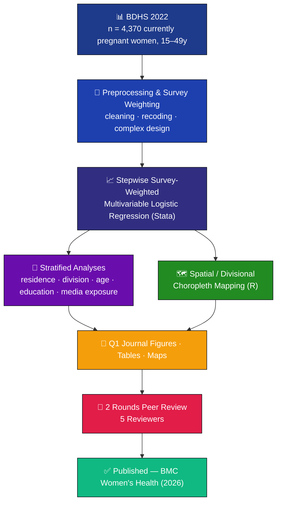
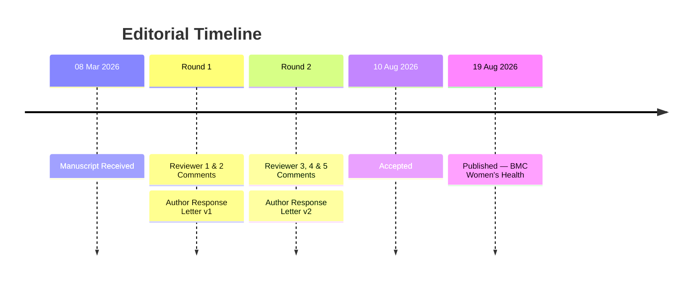

# <div align="center">


<br/>

# Association Between Internet Use and Unmet Need for Family Planning among Currently Pregnant Women in Bangladesh

### 📍 Evidence from the Bangladesh Demographic and Health Survey (BDHS) 2022

<br/>

[](https://doi.org/10.1186/s12905-026-04788-2)
[](https://doi.org/10.1186/s12905-026-04788-2)
[](https://www.springernature.com/gp/open-science/about-the-fundamentals-of-open-access-and-open-research)
[](#-peer-review--revision-trail)
[](LICENSE)

<br/>


<br/>


</div>

---

## 📖 Citation

> Miah, M.S., Uddin, M.J. **Association between internet use and unmet need for family planning among currently pregnant women in Bangladesh: evidence from BDHS 2022.** *BMC Women's Health* (2026). https://doi.org/10.1186/s12905-026-04788-2

```bibtex
@article{miah_uddin_2026_unmet_need,
  title    = {Association between internet use and unmet need for family planning
              among currently pregnant women in Bangladesh: evidence from BDHS 2022},
  author   = {Miah, Md Salek and Uddin, Md Jamal},
  journal  = {BMC Women's Health},
  year     = {2026},
  doi      = {10.1186/s12905-026-04788-2},
  url      = {https://doi.org/10.1186/s12905-026-04788-2},
  note     = {Open Access}
}
```

<div align="center">

[](https://link.springer.com/content/pdf/10.1186/s12905-026-04788-2_reference.pdf)
[-228B22?style=for-the-badge&logo=microsoftword&logoColor=white)](https://media.springernature.com/original/springer-static/esm/art%3A10.1186%2Fs12905-026-04788-2/MediaObjects/12905_2026_4788_MOESM1_ESM.docx)

</div>

---

## 🧭 Overview


Unmet need for family planning remains a persistent public health challenge in low- and middle-income countries and a core indicator for **SDG 3 — Universal Health Coverage**. This study is among the first to examine how **internet use** relates to unmet need for family planning specifically among **currently pregnant women** in Bangladesh, integrating nationally representative survey data with divisional spatial mapping to surface where the burden concentrates.

This repository is a **complete, transparent research compendium** — not just analysis scripts. It contains the full audit trail from raw modeling through two rounds of peer review to the final published figures and tables, in line with open-science and reproducibility norms (STROBE-compliant reporting).

<br clear="right"/>

---

## 👥 Authors & Affiliations

<div align="center">

<table>
<tr>
<td width="50%" valign="top" align="center">

### 🧑‍🔬 Md Salek Miah *(First Author)*


Research Assistant, Department of Statistics  
Shahjalal University of Science and Technology (SUST)  
Sylhet-3114, Bangladesh

📧 [saleksta@gmail.com](mailto:saleksta@gmail.com)

[](https://orcid.org/0009-0005-5973-461X)
[](https://www.linkedin.com/in/md-salek-miah-b34309329/)
[](https://scholar.google.co.uk/scholar?as_sauthors=%22Md%20Salek%20Miah%22)
[](https://link.springer.com/researchers/74308750SN)
[](https://www.youtube.com/@SalekResearch)

</td>
<td width="50%" valign="top" align="center">

### 🎓 Md Jamal Uddin, Ph.D. *(Corresponding Author)*


Professor, Department of Statistics, SUST, Sylhet-3114, Bangladesh  
Faculty of Graduate Education, Daffodil International University, Dhaka

📞 +8801716972846  
📧 [jamal-sta@sust.edu](mailto:jamal-sta@sust.edu)

[](https://orcid.org/0000-0002-8360-3274)
[](https://scholar.google.com/citations?user=tMZWkOUAAAAJ)

</td>
</tr>
</table>

**Biostatistics, Epidemiology, and Public Health Research Team**  
Department of Statistics · Shahjalal University of Science & Technology (SUST) · Sylhet-3114, Bangladesh

</div>

---

## 🔬 Methodology at a Glance

<div align="center">

| Feature | Details |
|:--|:--|
| **Exposure Variable** | Internet use (frequency and access) |
| **Outcome Variable** | Unmet need for family planning |
| **Population** | Currently pregnant women, 15–49 years |
| **Sample Size** | n = 4,370 |
| **Survey Design** | BDHS 2022 complex survey with proper weighting |
| **Statistical Method** | Stepwise survey-weighted multivariable logistic regression · aOR/cOR · 95% CI |
| **Stratification** | Residence · division · maternal age · age at first birth · education · media exposure |
| **Spatial Scope** | 8 divisions of Bangladesh |
| **Spatial Method** | Descriptive divisional choropleth mapping |
| **Reporting Standard** | STROBE-compliant, with a participant-flow methodology flowchart |
| **Output Format** | 300 DPI publication-ready figures and formatted tables |
| **Peer Review** | 2 rounds, 5 independent reviewers — full trail archived in this repository |
| **AI Disclosure** | Grammarly / QuillBot / GPT-4 used for language editing only — no AI involvement in data generation, analysis, or interpretation |

</div>

---

## 🔄 Analytical Pipeline



---

## 🔑 Key Findings

<div align="center">

| Metric | Estimate |
|:--|:--:|
| 👥 Sample size | **n = 4,370** currently pregnant women, 15–49 years |
| 📉 Prevalence of unmet need for FP | **41%** |
| 🌐 Internet use → unmet need (adjusted) | **aOR = 1.83** (95% CI: 1.52–2.20) |
| 🍼 Early age at first birth (10–17y) | **aOR = 2.70** (95% CI: 1.91–3.82) |
| 🎂 Age 25–34 years | **aOR = 2.41** (95% CI: 1.82–3.17) |
| 📚 No formal education | **aOR = 5.34** (95% CI: 1.70–16.71) |
| 📍 Barishal division | **aOR = 3.24** (95% CI: 1.99–5.28) |
| 📍 Rajshahi division | **aOR = 3.30** (95% CI: 1.62–6.72) |
| 📍 Sylhet division | **aOR = 2.98** (95% CI: 1.96–4.53) |
| 🗺️ Highest raw prevalence (spatial) | **Chattogram** division |

</div>

> Internet use was significantly associated with a higher unmet need for family planning among currently pregnant women in Bangladesh, with the strength of association varying meaningfully across socio-demographic and regional subgroups — evidence that can help target family planning programs toward the population groups carrying the greatest burden.

### 📊 Effect Size Snapshot (Adjusted Odds Ratios)

```
Internet use (overall) ████████████░░░░░░░░░░░░░░░░░░  aOR 1.83
Sylhet division         ████████████████████░░░░░░░░░░  aOR 2.98
Age 25–34               ████████████████░░░░░░░░░░░░░░  aOR 2.41
Early first birth       ██████████████████░░░░░░░░░░░░  aOR 2.70
Barishal division       █████████████████████░░░░░░░░░  aOR 3.24
Rajshahi division       ██████████████████████░░░░░░░░  aOR 3.30
No formal education     ████████████████████████████░░  aOR 5.34
                         0        1        2       3       4       5+
```

---

## 📊 Key Figures

### Figure 1: Participant Flowchart — Sample Selection from BDHS 2022

<div align="center">

| **Figure 1: Participant selection and analytical workflow from BDHS 2022** |
|:--:|
|  |
| *Caption: Participant selection and analytical workflow from BDHS 2022. The flowchart illustrates the step-by-step process from initial sample selection (n = 30,129) to final analytical cohort (n = 4,370 currently pregnant women aged 15–49 years).* |
| [⬇️ Download PDF](Contraception_BD.pdf) |

</div>

---

### Figure 2: Divisional Prevalence of Unmet Need for Family Planning

<div align="center">

| **Figure 2: Choropleth map of unmet need prevalence across Bangladesh divisions** |
|:--:|
|  |
| *Caption: Choropleth map showing the prevalence of unmet need for family planning across the 8 divisions of Bangladesh (BDHS 2022). Data sourced from the BDHS 2022 survey, representing 4,370 currently pregnant women aged 15–49 years.* |

</div>

---

## 📁 Repository Structure

```bash
BDHS-Unmet-Need-Analysis/
│
├── 📘 README.md                           # You are here
├── 📄 LICENSE                             # MIT License
│
├── 📊 ANALYSIS CODE
│   ├── Analysis.do                        # Main Stata script (descriptive + stepwise logistic regression)
│   ├── Spatials.do                        # Stata spatial data preparation
│   └── Spatial_Figures.R                  # R script for divisional choropleth maps
│
├── 🗃️ DATA
│   ├── descriptive_data.dta               # Cleaned analytic dataset (Stata format)
│   └── division_unmet_need_share.csv      # Division-level prevalence estimates
│
├── 🖼️ METHODOLOGY & FIGURES
│   ├── Flowchart.tex                      # LaTeX source — participant selection flowchart
│   ├── Contraception_BD.pdf               # Rendered methodology flowchart (PDF) — Figure 1
│   └── Figure 1.pdf                       # Manuscript Figure 2 — Choropleth map
│
├── 📑 PUBLICATION TABLES
│   ├── Table 1.docx                       # Table 1 — sample characteristics
│   └── Table 2.docx                       # Table 2 — regression results
│
├── 📁 PEER REVIEW & REVISION TRAIL
│   ├── reviewrs 2.pdf                     # Reviewer 2 comments (Round 1)
│   ├── Tracked_Changed_Comments_Reviewr_1.pdf   # Reviewer 1 tracked-changes (Round 1)
│   ├── RESPONSE LETTER.pdf                # Author response letter (Round 1)
│   ├── Reviewr 3.pdf                      # Reviewer 3 comments (Round 2)
│   ├── Reviewr 4.docx                     # Reviewer 4 comments (Round 2)
│   ├── Reviewr 5.docx                     # Reviewer 5 comments (Round 2)
│   └── Response Letter_V2.pdf             # Author response letter (Round 2)
│
└── 📦 ARCHIVE
    └── BDHS-Professor-Repository-Upgrade.zip   # Archived version (2026)

```

---

## 🔁 Peer Review & Revision Trail

This repository documents the **complete editorial history** of the manuscript from submission to acceptance at *BMC Women's Health* — provided in the spirit of open, transparent, and reproducible science.



| Round | Reviewer Feedback | Author Response |
|:--:|:--|:--|
| **Round 1** | [`reviewrs 2.pdf`](reviewrs%202.pdf) · [`Tracked_Changed_Comments_Reviewr_1.pdf`](Tracked_Changed_Comments_Reviewr_1.pdf) | [`RESPONSE LETTER.pdf`](RESPONSE%20LETTER.pdf) |
| **Round 2** | [`Reviewr 3.pdf`](Reviewr%203.pdf) · [`Reviewr 4.docx`](Reviewr%204.docx) · [`Reviewr 5.docx`](Reviewr%205.docx) | [`Response Letter_V2.pdf`](Response%20Letter_V2.pdf) |

> **Timeline:** Received 08 March 2026 → Accepted 10 August 2026 → Published 19 August 2026 — five independent reviewers across two revision rounds.

---

## 🗂️ Data Source

| Dataset | Source | Description |
|:--|:--|:--|
| **BDHS 2022** | [DHS Program](https://dhsprogram.com) | Bangladesh Demographic & Health Survey 2022 |
| **Division Shapefile** | Bangladesh Admin Boundaries | 8 Divisions — spatial polygons |
| `descriptive_data.dta` | Cleaned analytic sample | Currently pregnant women, 15–49y, weighted |
| `division_unmet_need_share.csv` | Derived from BDHS | Division-level prevalence of unmet need |

> **Note:** Raw DHS microdata requires registration at [dhsprogram.com](https://dhsprogram.com). Derived/aggregated data files in this repository are freely available.

---

## 🛠️ Tech Stack

<div align="center">


<br/>


</div>

---

## 🚀 Quick Start

**Requirements:** Stata `>= 15` · R `>= 4.2` · LaTeX (for flowchart compilation, optional)

<details open>
<summary><b>Step 1 — Statistical Analysis (Stata)</b></summary>

```stata
cd "/path/to/BDHS-Unmet-Need-Analysis"
use "descriptive_data.dta", clear
do Analysis.do
do Spatials.do
```

</details>

<details open>
<summary><b>Step 2 — Spatial Figures (R)</b></summary>

```r
packages <- c(
  "sf", "readxl", "dplyr", "stringr", "janitor",
  "ggplot2", "ggspatial", "ggtext", "tmap",
  "spdep", "spatialreg", "rmapshaper",
  "viridis", "classInt", "patchwork", "tidyverse"
)

installed <- packages %in% rownames(installed.packages())
if (any(!installed)) {
  install.packages(packages[!installed], dependencies = TRUE)
}
invisible(lapply(packages, library, character.only = TRUE))

source("Spatial_Figures.R")
```

</details>

<details>
<summary><b>Step 3 — Methodology Flowchart (LaTeX, optional)</b></summary>

```bash
pdflatex Flowchart.tex
# → renders Contraception_BD.pdf
```

</details>

---

## 🌍 Research Impact

<div align="center">

| 🩺 Reproductive Health | 🗺️ Spatial Epidemiology | 🌐 Public Health | 📋 Health Policy | 🔓 Open Science |
|:--:|:--:|:--:|:--:|:--:|
| Digital determinants of family planning uptake among pregnant women | Maps geographic disparities in unmet need across 8 divisions | Evidence for SDG 3 — Universal Health Coverage monitoring | Subgroup-level insight for targeted FP interventions | Full compendium — code, data, figures, tables, peer-review trail |

</div>

---

## 🎓 Learn the Methods — Salek Data Lab

Free, hands-on tutorials on DHS data management, survey-weighted logistic regression, and R/Stata workflows for public health research:

<div align="center">

[](https://www.youtube.com/@SalekResearch)
[](https://github.com/muhammadsalek)

</div>

---

## 📜 License

**MIT License** (code) — Copyright (c) 2026 Md Salek Miah & Md Jamal Uddin

Article content is licensed **CC BY-NC-ND 4.0** by the authors under BMC Women's Health / Springer Nature. Citation required for any reuse.

---

## 📞 Contact & Collaboration

<div align="center">

**Biostatistics, Epidemiology, and Public Health Research Team**  
Department of Statistics · Shahjalal University of Science and Technology · Sylhet-3114, Bangladesh

[](mailto:saleksta@gmail.com)
[](https://github.com/muhammadsalek)
[](https://twitter.com/salekresearch)

</div>

---

<div align="center">

[](https://www.stata.com)
[](https://r-project.org)
[](https://dhsprogram.com)
[](https://www.sust.edu)

*⭐ Star this repo if it helped your research!*


</div>
