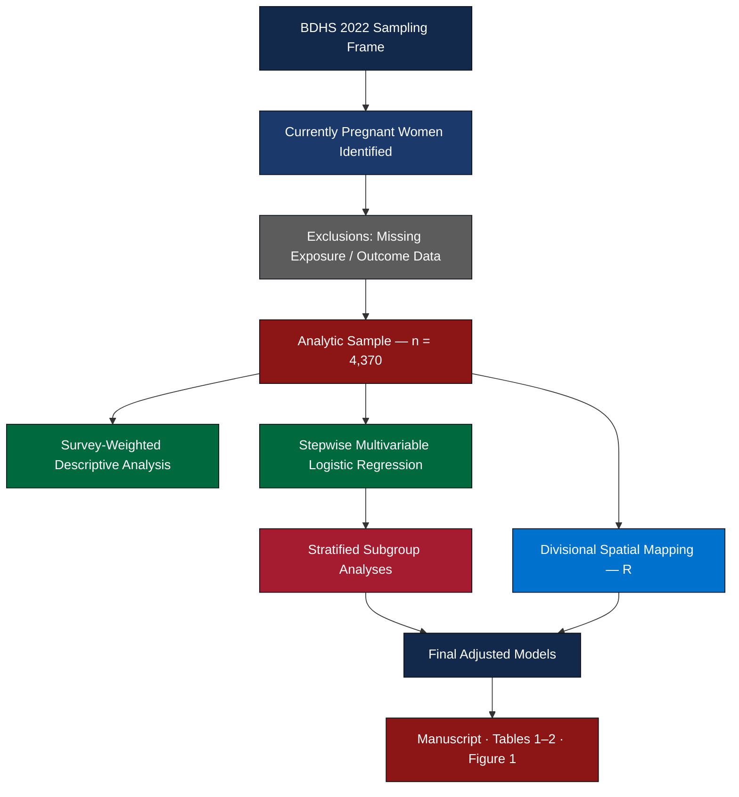
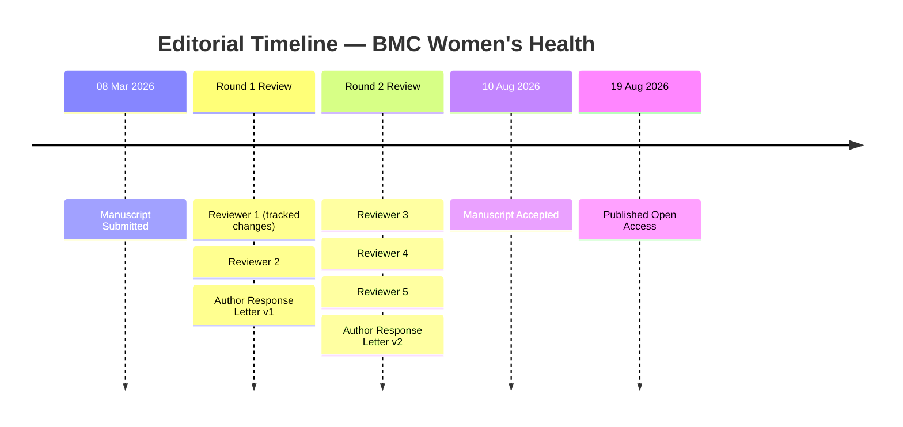

<div align="center">


<br/>

<sup>BIOSTATISTICS · EPIDEMIOLOGY · PUBLIC HEALTH RESEARCH TEAM</sup>
<br/>
<sup>DEPARTMENT OF STATISTICS · SHAHJALAL UNIVERSITY OF SCIENCE AND TECHNOLOGY</sup>

<br/><br/>

# Internet Use and Unmet Need for Family Planning
### among Currently Pregnant Women in Bangladesh

**Evidence from the Bangladesh Demographic and Health Survey (BDHS) 2022**

<br/>

`Md Salek Miah` · `Md Jamal Uddin, PhD`

<br/>

[](https://doi.org/10.1186/s12905-026-04788-2)
[](https://doi.org/10.1186/s12905-026-04788-2)
[](https://www.springernature.com/gp/open-science/about/the-fundamentals-of-open-access-and-open-research)
[](#peer-review--revision-history)

</div>

<br/>

<div align="center">

</div>

<br/>

<table width="100%">
<tr>
<td width="60%" valign="top">

### Abstract

Unmet need for family planning is a persistent public health burden in low- and middle-income countries and a core monitoring indicator under **SDG 3 — Universal Health Coverage**. Using nationally representative data from **4,370 currently pregnant women, aged 15–49**, drawn from the BDHS 2022, this study estimates the association between internet use and unmet need for family planning through stepwise survey-weighted multivariable logistic regression, with stratified analyses across residence, division, maternal age, age at first birth, education, and media exposure. Descriptive spatial mapping further characterizes divisional disparities in prevalence.

Overall, **41% of currently pregnant women** reported an unmet need for family planning. Women who used the internet had **83% higher adjusted odds** of unmet need relative to non-users (aOR 1.83, 95% CI 1.52–2.20), with markedly stronger associations among women with no formal education, early age at first birth, and residents of Barishal, Rajshahi, and Sylhet.

</td>
<td width="40%" valign="top">

<div align="center">

**Published**
19 August 2026

**Accepted**
10 August 2026

**Received**
08 March 2026

<br/>

[**Read the Full Text →**](https://link.springer.com/content/pdf/10.1186/s12905-026-04788-2_reference.pdf)
[**Supplementary Material →**](https://media.springernature.com/original/springer-static/esm/art%3A10.1186%2Fs12905-026-04788-2/MediaObjects/12905_2026_4788_MOESM1_ESM.docx)

</div>

</td>
</tr>
</table>

<br/>

```bibtex
@article{miah_uddin_2026_unmet_need,
  title    = {Association between internet use and unmet need for family planning
              among currently pregnant women in Bangladesh: evidence from BDHS 2022},
  author   = {Miah, Md Salek and Uddin, Md Jamal},
  journal  = {BMC Women's Health},
  year     = {2026},
  doi      = {10.1186/s12905-026-04788-2},
  url      = {https://doi.org/10.1186/s12905-026-04788-2}
}
```

<br/>

## Figure 1 — Study Design & Methodology

<div align="center">

<table>
<tr><td>

```
┌──────────────────────────────────────────────────────────────────┐
│                                                                    │
│                         FIGURE 1 PREVIEW                          │
│                                                                    │
│     Participant flow & analytic pipeline — rendered from          │
│     Flowchart.tex / Contraception_BD.pdf                          │
│                                                                    │
│     To display inline here, export Figure 1.pdf → Figure_1.png    │
│     (300 dpi) and place it in an /assets or /figures folder,      │
│     then this block becomes:                                      │
│                                                                    │
│                                  │
│                                                                    │
└──────────────────────────────────────────────────────────────────┘
```

</td></tr>
</table>

📄 [`Figure 1.pdf`](Figure%201.pdf) · 📄 [`Contraception_BD.pdf`](Contraception_BD.pdf) · 🧾 [`Flowchart.tex`](Flowchart.tex)

</div>

<br/>



<br/>

<div align="center">

</div>

## Principal Findings

<table width="100%">
<tr>
<td width="33%" align="center" valign="top">

### 41%
Prevalence of unmet need for family planning among currently pregnant women

</td>
<td width="33%" align="center" valign="top">

### 1.83×
Adjusted odds of unmet need among internet users vs. non-users
`95% CI 1.52–2.20`

</td>
<td width="33%" align="center" valign="top">

### 4,370
Currently pregnant women, ages 15–49, nationally representative

</td>
</tr>
</table>

<br/>

**Adjusted Odds Ratios — Stratified Subgroup Estimates**

| Subgroup | aOR | 95% CI |
|:--|:--:|:--:|
| Internet use (overall effect) | `1.83` | 1.52 – 2.20 |
| Age at first birth, 10–17 years | `2.70` | 1.91 – 3.82 |
| Maternal age, 25–34 years | `2.41` | 1.82 – 3.17 |
| No formal education | `5.34` | 1.70 – 16.71 |
| Sylhet division | `2.98` | 1.96 – 4.53 |
| Barishal division | `3.24` | 1.99 – 5.28 |
| Rajshahi division | `3.30` | 1.62 – 6.72 |

```
No formal education    ████████████████████████████████████████████████  5.34
Rajshahi division      ██████████████████████████████░░░░░░░░░░░░░░░░░░  3.30
Barishal division      ███████████████████████████████░░░░░░░░░░░░░░░░░  3.24
Sylhet division        ██████████████████████████████░░░░░░░░░░░░░░░░░░  2.98
Early first birth      █████████████████████████████░░░░░░░░░░░░░░░░░░░  2.70
Age 25–34               █████████████████████████████░░░░░░░░░░░░░░░░░░░  2.41
Internet use, overall   ██████████████████░░░░░░░░░░░░░░░░░░░░░░░░░░░░░░  1.83
                         0        1        2        3        4        5+     aOR
```

> Descriptive spatial analysis further identified **Chattogram** as the division with the highest raw prevalence of unmet need for family planning, distinct from the divisions showing the strongest *adjusted* internet-use associations — underscoring that raw prevalence and modeled risk factors surface different policy targets.

<br/>

<div align="center">

</div>

## Research Team

<table width="100%">
<tr>
<td width="50%" valign="top">


**Md Salek Miah**
*First Author*
Research Assistant, Department of Statistics
Shahjalal University of Science and Technology (SUST)

📧 saleksta@gmail.com
[ORCID](https://orcid.org/0009-0005-5973-461X) · [LinkedIn](https://www.linkedin.com/in/md-salek-miah-b34309329/) · [Google Scholar](https://scholar.google.co.uk/scholar?as_sauthors=%22Md%20Salek%20Miah%22) · [Springer Profile](https://link.springer.com/researchers/74308750SN) · [YouTube](https://www.youtube.com/@SalekResearch)

</td>
<td width="50%" valign="top">

**Md Jamal Uddin, Ph.D.**
*Corresponding Author*
Professor, Department of Statistics, SUST
Faculty of Graduate Education, Daffodil International University, Dhaka

📞 +8801716972846
📧 jamal-sta@sust.edu
[ORCID](https://orcid.org/0000-0002-8360-3274)

</td>
</tr>
</table>

<div align="center"><sub>Biostatistics, Epidemiology, and Public Health Research Team · Department of Statistics · SUST, Sylhet-3114, Bangladesh</sub></div>

<br/>

<div align="center">

</div>

## Repository Contents

```
BDHS-Unmet-Need-Analysis
│
├── README.md
├── LICENSE
│
├── analysis/
│   ├── Analysis.do                          Stata — descriptive statistics & stepwise logistic regression
│   ├── Spatials.do                          Stata — spatial data preparation
│   └── Spatial_Figures.R                    R — divisional choropleth mapping
│
├── data/
│   ├── descriptive_data.dta                 Cleaned analytic sample (Stata)
│   └── division_unmet_need_share.csv        Division-level prevalence estimates
│
├── figures/
│   ├── Flowchart.tex                        LaTeX source — participant flow diagram
│   ├── Contraception_BD.pdf                 Rendered methodology flowchart
│   └── Figure 1.pdf                         Manuscript Figure 1
│
├── tables/
│   ├── Table 1.docx                         Sample characteristics
│   └── Table 2.docx                         Regression results
│
├── peer_review/
│   ├── reviewrs 2.pdf                       Reviewer 2 — Round 1
│   ├── Tracked_Changed_Comments_Reviewr_1.pdf   Reviewer 1 — Round 1
│   ├── RESPONSE LETTER.pdf                  Author response — Round 1
│   ├── Reviewr 3.pdf                        Reviewer 3 — Round 2
│   ├── Reviewr 4.docx                       Reviewer 4 — Round 2
│   ├── Reviewr 5.docx                       Reviewer 5 — Round 2
│   └── Response Letter_V2.pdf               Author response — Round 2
│
└── BDHS-Professor-Repository-Upgrade.zip    Archived repository snapshot
```

<br/>

## Peer Review & Revision History

This repository preserves the **complete editorial record** of the manuscript, from initial submission through acceptance at *BMC Women's Health* — offered in the interest of transparent, reproducible science and as documentation of the study's methodological rigor.



<table width="100%">
<tr><th align="left" width="15%">Round</th><th align="left" width="45%">Reviewer Correspondence</th><th align="left" width="40%">Author Response</th></tr>
<tr>
<td valign="top"><b>Round 1</b></td>
<td valign="top">

[`Tracked_Changed_Comments_Reviewr_1.pdf`](Tracked_Changed_Comments_Reviewr_1.pdf)
[`reviewrs 2.pdf`](reviewrs%202.pdf)

</td>
<td valign="top">

[`RESPONSE LETTER.pdf`](RESPONSE%20LETTER.pdf)

</td>
</tr>
<tr>
<td valign="top"><b>Round 2</b></td>
<td valign="top">

[`Reviewr 3.pdf`](Reviewr%203.pdf)
[`Reviewr 4.docx`](Reviewr%204.docx)
[`Reviewr 5.docx`](Reviewr%205.docx)

</td>
<td valign="top">

[`Response Letter_V2.pdf`](Response%20Letter_V2.pdf)

</td>
</tr>
</table>

<br/>

<div align="center">

</div>

## Reproducing the Analysis

**Environment:** Stata ≥ 15 · R ≥ 4.2 · LaTeX *(optional, for flowchart compilation)*

**1 — Statistical modeling (Stata)**

```stata
cd "/path/to/BDHS-Unmet-Need-Analysis"
use "descriptive_data.dta", clear
do Analysis.do
do Spatials.do
```

**2 — Spatial figures (R)**

```r
packages <- c(
  "sf", "readxl", "dplyr", "stringr", "janitor",
  "ggplot2", "ggspatial", "ggtext", "tmap", "spdep",
  "spatialreg", "rmapshaper", "viridis", "classInt",
  "patchwork", "tidyverse"
)

installed <- packages %in% rownames(installed.packages())
if (any(!installed)) install.packages(packages[!installed], dependencies = TRUE)
invisible(lapply(packages, library, character.only = TRUE))

source("Spatial_Figures.R")
```

**3 — Methodology flowchart (LaTeX, optional)**

```bash
pdflatex Flowchart.tex     # → Contraception_BD.pdf
```

<br/>

## Data Provenance

| Dataset | Source | Description |
|:--|:--|:--|
| BDHS 2022 | [DHS Program](https://dhsprogram.com) | Bangladesh Demographic & Health Survey, 2022 round |
| Division boundaries | Bangladesh Admin Boundaries | 8 administrative divisions, spatial polygons |
| `descriptive_data.dta` | Derived from BDHS 2022 | Cleaned, weighted analytic sample — currently pregnant women, 15–49y |
| `division_unmet_need_share.csv` | Derived from BDHS 2022 | Division-level prevalence of unmet need |

Raw DHS microdata requires registration and approval via [dhsprogram.com](https://dhsprogram.com); derived, de-identified outputs in this repository are freely available for reuse with citation.

<br/>

## Methods Summary

| | |
|:--|:--|
| **Design** | Cross-sectional, nationally representative |
| **Population** | Currently pregnant women, 15–49 years (n = 4,370) |
| **Exposure** | Internet use (frequency and access) |
| **Outcome** | Unmet need for family planning |
| **Survey design** | Complex survey weighting, per BDHS sampling protocol |
| **Primary model** | Stepwise survey-weighted multivariable logistic regression |
| **Stratification** | Residence, division, maternal age, age at first birth, education, media exposure |
| **Spatial analysis** | Descriptive divisional choropleth mapping (R) |
| **Reporting standard** | STROBE-compliant, with participant-flow diagram |
| **Generative AI use** | Grammarly, QuillBot, and GPT-4 for language editing only — no role in data generation, analysis, or interpretation |

<br/>

## Significance

| Domain | Contribution |
|:--|:--|
| Reproductive health | First evidence linking internet use to unmet need for family planning among *pregnant* women in Bangladesh |
| Spatial epidemiology | Divisional mapping reveals geographic disparities distinct from adjusted risk-factor patterns |
| Global health policy | Directly informs SDG 3 (Universal Health Coverage) monitoring |
| Programmatic targeting | Subgroup-specific estimates support precision targeting of family planning services |
| Open science | Full compendium — code, data, figures, tables, and complete peer-review record |

<br/>

## Salek Data Lab

Open educational content on DHS data management, survey-weighted regression, and applied biostatistics workflows in R and Stata.

<div align="center">

[](https://www.youtube.com/@SalekResearch)

</div>

<br/>

<div align="center">

</div>

<div align="center">

<sub>**License:** MIT (code) · Article content © 2026 The Author(s), licensed CC BY-NC-ND 4.0 via BMC Women's Health / Springer Nature</sub>

<sub>Biostatistics, Epidemiology, and Public Health Research Team · Department of Statistics · Shahjalal University of Science and Technology · Sylhet-3114, Bangladesh</sub>

<br/><br/>

<sub>⭐ If this repository supports your research, please consider starring it.</sub>

</div>
