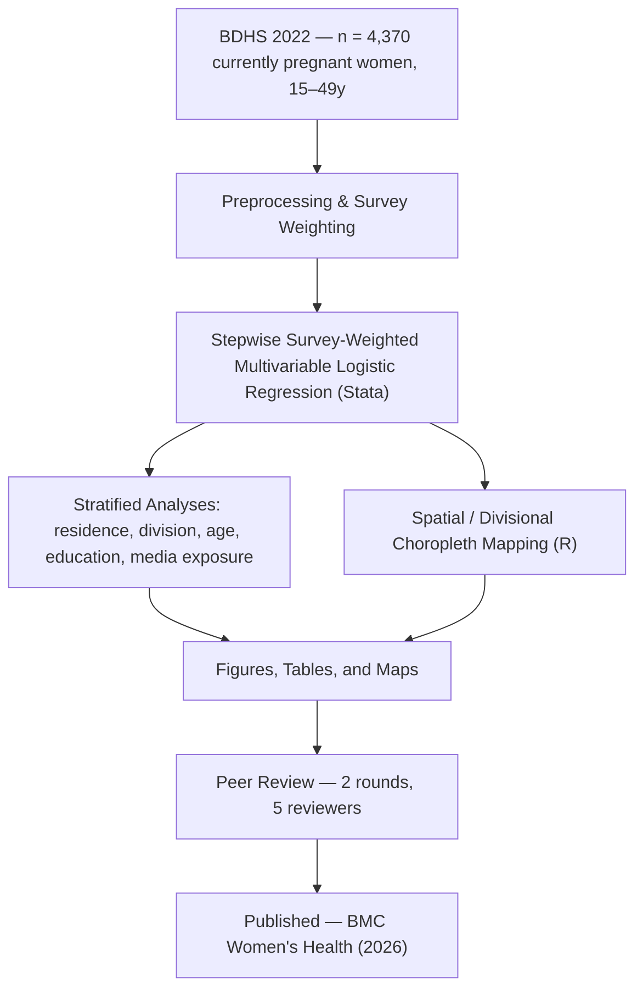

# Association Between Internet Use and Unmet Need for Family Planning among Currently Pregnant Women in Bangladesh

**Evidence from the Bangladesh Demographic and Health Survey (BDHS) 2022**

[](https://doi.org/10.1186/s12905-026-04788-2)
[](https://doi.org/10.1186/s12905-026-04788-2)
[](https://www.springernature.com/gp/open-science/about-the-fundamentals-of-open-access-and-open-research)
[](LICENSE)

---

## Citation

> Miah, M.S., Uddin, M.J. **Association between internet use and unmet need for family planning among currently pregnant women in Bangladesh: evidence from BDHS 2022.** *BMC Women's Health* (2026). https://doi.org/10.1186/s12905-026-04788-2

```bibtex
@article{miah_uddin_2026_unmet_need,
  title    = {Association between internet use and unmet need for family planning
              among currently pregnant women in Bangladesh: evidence from BDHS 2022},
  author   = {Miah, Md Salek and Uddin, Md Jamal},
  journal  = {BMC Women's Health},
  year     = {2026},
  doi      = {10.1186/s12905-026-04788-2},
  url      = {https://doi.org/10.1186/s12905-026-04788-2},
  note     = {Open Access}
}
```

[Download Full Text (PDF)](https://link.springer.com/content/pdf/10.1186/s12905-026-04788-2_reference.pdf) · [Supplementary Material (.docx)](https://media.springernature.com/original/springer-static/esm/art%3A10.1186%2Fs12905-026-04788-2/MediaObjects/12905_2026_4788_MOESM1_ESM.docx)

---

## Overview

Unmet need for family planning remains a persistent public health challenge in low- and middle-income countries and a core indicator for **SDG 3 — Universal Health Coverage**. This study is among the first to examine how internet use relates to unmet need for family planning specifically among currently pregnant women in Bangladesh, using nationally representative survey data.

This repository is a complete, transparent research compendium — analysis code, data, figures, tables, and the full peer-review trail — provided in the interest of open science and reproducibility (STROBE-compliant reporting).

---

## Authors and Affiliations

**Md Salek Miah** *(First Author)*
Research Assistant, Department of Statistics
Shahjalal University of Science and Technology (SUST), Sylhet-3114, Bangladesh
Email: [saleksta@gmail.com](mailto:saleksta@gmail.com) · ORCID: [0009-0005-5973-461X](https://orcid.org/0009-0005-5973-461X) · [Google Scholar](https://scholar.google.co.uk/scholar?as_sauthors=%22Md%20Salek%20Miah%22)

**Md Jamal Uddin, Ph.D.** *(Corresponding Author)*
Professor, Department of Statistics, SUST, Sylhet-3114, Bangladesh
Faculty of Graduate Education, Daffodil International University, Dhaka
Email: [jamal-sta@sust.edu](mailto:jamal-sta@sust.edu) · ORCID: [0000-0002-8360-3274](https://orcid.org/0000-0002-8360-3274) · [Google Scholar](https://scholar.google.com/citations?user=tMZWkOUAAAAJ)

*Biostatistics, Epidemiology, and Public Health Research Team, Department of Statistics, SUST, Sylhet-3114, Bangladesh*

---

## Methodology at a Glance

| Feature | Details |
|---|---|
| Exposure variable | Internet use (frequency and access) |
| Outcome variable | Unmet need for family planning |
| Population | Currently pregnant women, 15–49 years |
| Sample size | n = 4,370 |
| Survey design | BDHS 2022 complex survey with proper weighting |
| Statistical method | Stepwise survey-weighted multivariable logistic regression (aOR/cOR, 95% CI) |
| Stratification | Residence, division, maternal age, age at first birth, education, media exposure |
| Spatial scope | 8 divisions of Bangladesh |
| Spatial method | Descriptive divisional choropleth mapping |
| Reporting standard | STROBE-compliant, with participant-flow methodology flowchart |
| Output format | 300 DPI publication-ready figures and formatted tables |
| Peer review | 2 rounds, 5 independent reviewers — full trail archived in this repository |
| AI disclosure | Grammarly / QuillBot / GPT-4 used for language editing only — no AI involvement in data generation, analysis, or interpretation |

---

## Analytical Pipeline



---

## Key Findings

| Metric | Estimate |
|---|---:|
| Sample size | n = 4,370 currently pregnant women, 15–49 years |
| Prevalence of unmet need for FP | 41% |
| Internet use → unmet need (adjusted) | aOR = 1.83 (95% CI: 1.52–2.20) |
| Early age at first birth (10–17y) | aOR = 2.70 (95% CI: 1.91–3.82) |
| Age 25–34 years | aOR = 2.41 (95% CI: 1.82–3.17) |
| No formal education | aOR = 5.34 (95% CI: 1.70–16.71) |
| Barishal division | aOR = 3.24 (95% CI: 1.99–5.28) |
| Rajshahi division | aOR = 3.30 (95% CI: 1.62–6.72) |
| Sylhet division | aOR = 2.98 (95% CI: 1.96–4.53) |
| Highest raw prevalence (spatial) | Chattogram division |

> Internet use was significantly associated with a higher unmet need for family planning among currently pregnant women in Bangladesh, with the strength of association varying across socio-demographic and regional subgroups — evidence that can help target family planning programs toward the population groups carrying the greatest burden.

---

## Figure 1: Participant Flowchart — Sample Selection from BDHS 2022

**Figure 1: Participant selection and analytical workflow from BDHS 2022**

<p align="center">
  
</p>

*Participant selection and analytical workflow from BDHS 2022.*

**Caption:** Participant selection and analytical workflow from BDHS 2022. The flowchart illustrates the step-by-step process from initial sample selection (n = 30,129) to final analytical cohort (n = 4,370 currently pregnant women aged 15–49 years).

[Download PDF](Contraception_BD.pdf)

---

## Repository Structure

```
BDHS-Unmet-Need-Analysis/
│
├── README.md                              # This file
├── LICENSE                                # MIT License
│
├── Analysis code
│   ├── Analysis.do                        # Main Stata script (descriptive + stepwise logistic regression)
│   ├── Spatials.do                        # Stata spatial data preparation
│   └── Spatial_Figures.R                  # R script for divisional choropleth maps
│
├── Data
│   ├── descriptive_data.dta               # Cleaned analytic dataset (Stata format)
│   └── division_unmet_need_share.csv      # Division-level prevalence estimates
│
├── Methodology & figures
│   ├── Flowchart.tex                      # LaTeX source — participant selection flowchart
│   └── Contraception_BD.pdf               # Rendered methodology flowchart (PDF) — Figure 1
│
├── Publication tables
│   ├── Table 1.docx                       # Table 1 — sample characteristics
│   └── Table 2.docx                       # Table 2 — regression results
│
├── Peer review & revision trail
│   ├── reviewrs 2.pdf                     # Reviewer 2 comments (Round 1)
│   ├── Tracked_Changed_Comments_Reviewr_1.pdf   # Reviewer 1 tracked changes (Round 1)
│   ├── RESPONSE LETTER.pdf                # Author response letter (Round 1)
│   ├── Reviewr 3.pdf                      # Reviewer 3 comments (Round 2)
│   ├── Reviewr 4.docx                     # Reviewer 4 comments (Round 2)
│   ├── Reviewr 5.docx                     # Reviewer 5 comments (Round 2)
│   └── Response Letter_V2.pdf             # Author response letter (Round 2)
│
└── Archive
    └── BDHS-Professor-Repository-Upgrade.zip
```

---

## Peer Review and Revision Trail

This repository documents the complete editorial history of the manuscript from submission to acceptance at *BMC Women's Health*, provided in the interest of open, transparent, and reproducible science.

| Milestone | Date |
|---|---|
| Manuscript received | 08 March 2026 |
| Round 1 review (Reviewers 1 & 2) | — |
| Round 2 review (Reviewers 3, 4 & 5) | — |
| Accepted | 10 August 2026 |
| Published — *BMC Women's Health* | 19 August 2026 |

| Round | Reviewer Feedback | Author Response |
|---|---|---|
| Round 1 | [`reviewrs 2.pdf`](reviewrs%202.pdf) · [`Tracked_Changed_Comments_Reviewr_1.pdf`](Tracked_Changed_Comments_Reviewr_1.pdf) | [`RESPONSE LETTER.pdf`](RESPONSE%20LETTER.pdf) |
| Round 2 | [`Reviewr 3.pdf`](Reviewr%203.pdf) · [`Reviewr 4.docx`](Reviewr%204.docx) · [`Reviewr 5.docx`](Reviewr%205.docx) | [`Response Letter_V2.pdf`](Response%20Letter_V2.pdf) |

---

## Data Source

| Dataset | Source | Description |
|---|---|---|
| BDHS 2022 | [DHS Program](https://dhsprogram.com) | Bangladesh Demographic & Health Survey 2022 |
| Division shapefile | Bangladesh administrative boundaries | 8 divisions — spatial polygons |
| `descriptive_data.dta` | Cleaned analytic sample | Currently pregnant women, 15–49y, weighted |
| `division_unmet_need_share.csv` | Derived from BDHS | Division-level prevalence of unmet need |

Raw DHS microdata requires registration at [dhsprogram.com](https://dhsprogram.com). Derived and aggregated data files in this repository are freely available.

---

## Tech Stack

Stata · R (≥ 4.2) · LaTeX (for flowchart compilation)

R packages: `sf`, `spdep`, `spatialreg`, `tmap`, `ggplot2`, `tidyverse`, `viridis`, `patchwork`

---

## Quick Start

**Requirements:** Stata ≥ 15 · R ≥ 4.2 · LaTeX (optional, for flowchart compilation)

**Step 1 — Statistical analysis (Stata)**

```stata
cd "/path/to/BDHS-Unmet-Need-Analysis"
use "descriptive_data.dta", clear
do Analysis.do
do Spatials.do
```

**Step 2 — Spatial figures (R)**

```r
packages <- c(
  "sf", "readxl", "dplyr", "stringr", "janitor",
  "ggplot2", "ggspatial", "ggtext", "tmap",
  "spdep", "spatialreg", "rmapshaper",
  "viridis", "classInt", "patchwork", "tidyverse"
)

installed <- packages %in% rownames(installed.packages())
if (any(!installed)) {
  install.packages(packages[!installed], dependencies = TRUE)
}
invisible(lapply(packages, library, character.only = TRUE))

source("Spatial_Figures.R")
```

**Step 3 — Methodology flowchart (LaTeX, optional)**

```bash
pdflatex Flowchart.tex
# → renders Contraception_BD.pdf
```

---

## Research Impact

| Area | Contribution |
|---|---|
| Reproductive health | Digital determinants of family planning uptake among pregnant women |
| Spatial epidemiology | Maps geographic disparities in unmet need across 8 divisions |
| Public health | Evidence for SDG 3 — Universal Health Coverage monitoring |
| Health policy | Subgroup-level insight for targeted FP interventions |
| Open science | Full compendium — code, data, figures, tables, peer-review trail |

---

## License

**MIT License** (code) — Copyright © 2026 Md Salek Miah & Md Jamal Uddin

Article content is licensed CC BY-NC-ND 4.0 by the authors under BMC Women's Health / Springer Nature. Citation required for any reuse.

---

## Contact

Biostatistics, Epidemiology, and Public Health Research Team
Department of Statistics, Shahjalal University of Science and Technology, Sylhet-3114, Bangladesh

Email: [saleksta@gmail.com](mailto:saleksta@gmail.com) · GitHub: [muhammadsalek](https://github.com/muhammadsalek)
